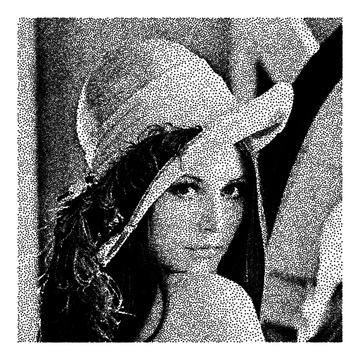

ImageStippling
=======================
image stippling by poisson disk sampling

###build

`mkdir build`

`cd build`

`cmake ..`

`make`

###requirement
1.OpenCV
2.Eigen
3.Cairo

###usage
`Usage: Stippling [input_image] [output_images]`

###sample

